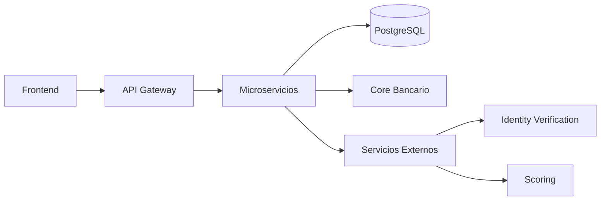
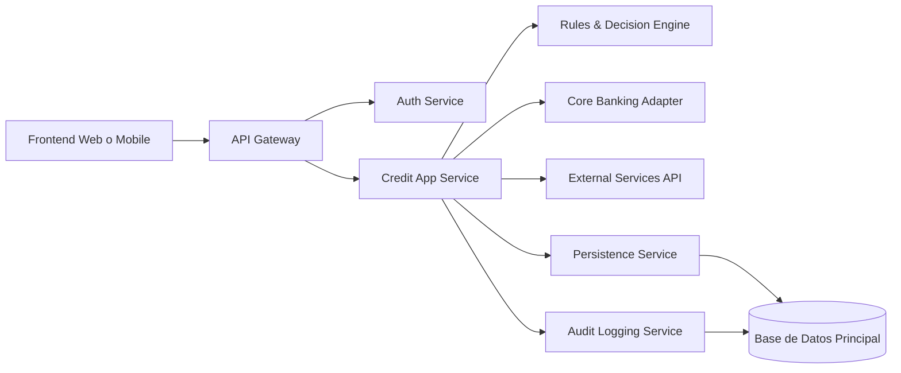
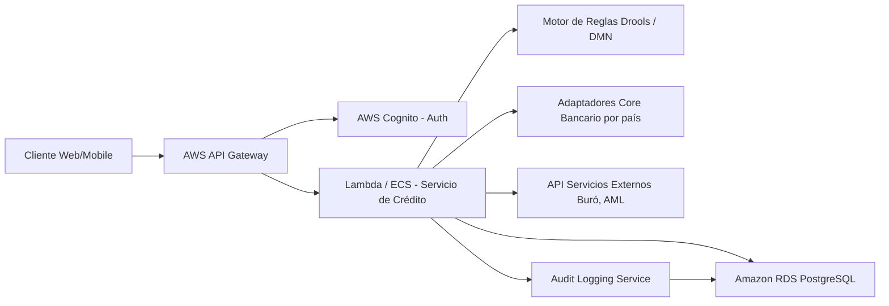

# Vista de Componentes

# Arquitectura para Plataforma de Créditos en Línea (Multipaís)

Esta arquitectura aprovecha los servicios de AWS para ofrecer una solución escalable, segura y auditable para la solicitud de créditos en línea, incluyendo integración con múltiples cores bancarios y servicios externos.

---

## 📦 Vista de Componentes

